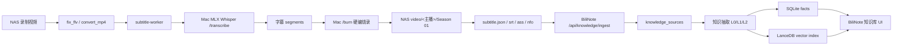

# PRD: 视频烧录到 LanceDB 知识库沉淀

更新时间：2026-05-26，北京时间 UTC+8

## 1. 背景

当前生产环境已经形成一条可运行的视频处理链路：

1. Bililive-go 在 NAS 上录制直播视频。
2. subtitle-worker 调用 Mac 端 MLX Whisper 服务生成字幕。
3. Mac 端使用硬件编码烧录字幕。
4. 成品回写 NAS 媒体库目录。
5. BiliNote 与 Mac LanceDB 服务已经具备知识库检索基础能力。

当前缺口是：视频已经能进入媒体库，但从“视频 + 字幕 + 元数据”到“可检索、可分类、可追溯、可重建的长期知识资产”的产品闭环还不完整。用户希望把长视频自动沉淀为知识库，后续可以检索精华、按主题分类、回跳视频时间戳，并能持续迭代。

## 2. 产品目标

本项目目标是建立一条稳定的“视频生产 -> 字幕烧录 -> 知识抽取 -> 语义检索 -> 知识沉淀”链路。

核心目标：

- Bililive-go 继续作为视频生产端，负责录制、字幕生成、烧录、媒体库归集。
- BiliNote 作为唯一长期知识中枢，负责知识抽取、分类、去重、索引、检索和 UI 管理。
- LanceDB 作为语义检索索引，配合 SQLite/文件元数据形成“事实源 + 向量索引”的双轨结构。
- 每个视频都能自动生成可读精华和可检索知识条目。
- 每条知识都能追溯到主播、视频、字幕片段和时间戳。
- 用户能对知识进行重建、归档、恢复、搜索和质量诊断。

## 3. 当前生产环境

### 3.1 NAS 环境

- NAS 地址：`192.168.1.80`
- 项目根目录：`/volume2/docker/bililive-go`
- Compose 目录：`/volume2/docker/bililive-go/bililive-go-ugreen`
- 原始录制/待处理目录：`/volume2/docker/bililive-go/srt_video`
- 成品媒体库目录：`/volume2/docker/bililive-go/video`
- 报告目录：`/volume2/docker/bililive-go/reports`
- 工具目录：`/volume2/docker/bililive-go/tools`

当前媒体库目标目录为：

```text
/volume2/docker/bililive-go/video/<主播>/Season 01/<主播>.S01E####.<日期> - <标题>.mp4
/volume2/docker/bililive-go/video/<主播>/Season 01/<主播>.S01E####.<日期> - <标题>.srt
/volume2/docker/bililive-go/video/<主播>/Season 01/<主播>.S01E####.<日期> - <标题>.ass
/volume2/docker/bililive-go/video/<主播>/Season 01/<主播>.S01E####.<日期> - <标题>.nfo
/volume2/docker/bililive-go/video/<主播>/Season 01/<主播>.S01E####.<日期> - <标题>.subtitle.json
```

### 3.2 Docker 服务

当前关键容器：

- `bililive`
  - 主服务。
  - 镜像：`docker.1ms.run/neymar022/bililive-go-app:latest`
  - 对外端口：`18090:5009`
- `subtitle-worker`
  - 字幕生成和烧录 worker。
  - 镜像：`docker.1ms.run/neymar022/bililive-go-subtitle-worker:latest`
- `bilinote-backend`
  - BiliNote 后端。
- `bilinote-frontend`
  - BiliNote 前端。

当前 pipeline API：

```text
GET  http://127.0.0.1:18090/api/pipeline/tasks/stats
GET  http://127.0.0.1:18090/api/pipeline/tasks
POST http://127.0.0.1:18090/api/subtitles/records/{relative_path}/rerun
```

### 3.3 字幕与烧录链路配置

subtitle-worker 当前核心链路：

```text
SUBTITLE_PROVIDER_CHAIN=remote-mac-mlx,dashscope,local-whisper
SUBTITLE_MAC_TRANSCRIBER_URL=http://192.168.1.17:8484
SUBTITLE_BURN_CHAIN=remote-mac,nas-software
SUBTITLE_MAC_BURN_URL=http://192.168.1.17:8484
```

含义：

- 优先使用 Mac 端 MLX Whisper 转写。
- Mac 不可达时才降级到 DashScope 或本地 Whisper。
- 烧录优先使用 Mac 端硬件编码。
- Mac 烧录不可达时才降级 NAS 软件烧录。

### 3.4 Mac MLX 运行层

Mac 转写服务：

- 服务标签：`com.bilinote.mac-transcriber`
- 服务端口：`8484`
- 健康检查：`http://192.168.1.17:8484/healthz`
- 转写模型：`mlx-whisper`
- 模型规格：`large-v3-turbo`
- 烧录编码：`h264_videotoolbox`

当前采用 MOVESPEED 分层承载：

```text
外层盘：/Volumes/MOVESPEED
运行镜像：/Volumes/MOVESPEED/BiliNoteRuntime.sparsebundle
APFS 挂载点：/Volumes/BiliNoteRuntime
运行项目：/Volumes/BiliNoteRuntime/BiliNote
临时目录：/Volumes/BiliNoteRuntime/tmp
Python：/Volumes/BiliNoteRuntime/BiliNote/backend/.venv/bin/python
MLX 模型：/Volumes/BiliNoteRuntime/BiliNote/backend/models/mlx-whisper/mlx-community/whisper-large-v3-turbo/weights.safetensors
```

设计意图：

- 避免直接在 iSCSI 目录中运行 Python、venv、MLX 模型和大临时文件。
- 用 MOVESPEED 上的 APFS sparsebundle 承载 Mac 运行时。
- NAS 仍保存视频输入和最终产物。

### 3.5 BiliNote 与 LanceDB

Mac LanceDB 服务：

- 服务标签：`com.bilinote.mac-lancedb`
- 服务端口：`8495`
- 健康检查：`http://127.0.0.1:8495/healthz`
- 当前数据目录：`/Volumes/BiliNoteRuntime/mac-lancedb/data`
- 当前表：`knowledge_items`

当前已验证能力：

- `/healthz` 返回 `ok=true`。
- `/search` 可返回命中结果。
- 当前进程运行在 `/Volumes/BiliNoteRuntime/BiliNote/backend/scripts/mac_lancedb_service.py`。
- 已迁移到 BiliNoteRuntime，避免继续使用 iSCSI 作为 LanceDB mmap/native runtime 的直接承载路径。

已知风险：

- 曾出现 `EXC_BAD_ACCESS (SIGBUS)`，内核报告 backing vnode 被 force unmounted。
- 该类问题与 mmap/native 文件所在卷被卸载或失效有关。
- LanceDB 必须运行在稳定挂载的本地 APFS runtime 上，不应直接放在易断开的 iSCSI 路径。

## 4. 当前已达成能力

### 4.1 干净成功样本

最近一次人工触发队列中，确认有 3 个干净成功样本：

| 任务 | 产物 | 视频时长 | 实际处理窗口 | 速度 |
|---|---|---:|---:|---:|
| 456 | `旭东聊装修.S01E0003.2026-05-23...` | 107.8 分钟 | 约 38.8 分钟 | 约 2.8x |
| 457 | `旭东聊装修.S01E0004.2026-05-23...` | 81.1 分钟 | 约 28.1 分钟 | 约 2.9x |
| 458 | `旭东聊装修.S01E0005.2026-05-24...` | 116.9 分钟 | 约 39.0 分钟 | 约 3.0x |

成功标准：

- `.mp4` 存在。
- `.srt` 存在。
- `.ass` 存在。
- `.nfo` 存在。
- `.subtitle.json` 存在。
- `.subtitle.json` 中 `status=completed`。
- `.subtitle.json` 中 `renderer_status=completed`。
- `.subtitle.json` 中 `render_preset=hevc_videotoolbox`。

### 4.2 媒体库归集

当前归集目标为：

```text
/volume2/docker/bililive-go/video/旭东聊装修/Season 01/
```

已验证：

- organizer dry-run 结果显示 `updated_links=0`、`updated_nfos=0`、`removed_files=0`。
- 已成功视频无需额外修复归集。
- 同一主播进入同一 `Season 01` 目录。

### 4.3 LanceDB 当前状态

当前 LanceDB 达到：

- 服务运行。
- health 正常。
- search 正常。
- 数据目录位于 BiliNoteRuntime。
- 当前未观察到迁移后的新 crash report。

但 LanceDB 目前只能证明“索引服务可用”，不能单独证明“视频知识沉淀质量已达标”。知识质量还需要通过 ingest、抽取、分类、去重和检索评测来验收。

## 5. 当前主要问题

### 5.1 重复入队导致 metadata 被覆盖

本次队列中出现过同一 source_path 被重复入队：

- 任务 `454/459` 指向同一源视频。
- 任务 `455/460` 指向同一源视频。

结果：

- 前一个任务可能已经生成物理产物。
- 后一个重复任务失败后覆盖 `.subtitle.json` 状态。
- 用户看到的结果可能变成“物理文件存在，但 metadata 显示 queued/failed”。

影响：

- 影响 UI 状态判断。
- 影响后续知识库 ingest。
- 影响是否可以安全清理源文件。
- 影响自动归集和重建判断。

PRD 要求：

- 同一源视频在任一时间只能有一个有效处理任务。
- enqueue 前必须按 `source_path` 或 normalized source identity 去重。
- 已存在完整产物时，不允许用失败 rerun 覆盖 completed metadata。

### 5.2 知识入库闭环不完整

当前已具备：

- 视频成品。
- 字幕文件。
- 字幕 JSON。
- BiliNote。
- LanceDB 服务。

仍需完善：

- 自动 ingest 触发。
- 知识抽取质量。
- 主题分类。
- 去重合并。
- 来源回跳。
- 搜索结果解释。
- 删除/重建按钮。
- 入库失败重试。
- 索引失败重建。

### 5.3 搜索体验仍需质量评估

已观察过的问题：

- 字幕时间轴文本混入搜索结果，阅读体验差。
- 命中片段质量不稳定。
- 弱相关结果可能进入主列表。
- 需要区分“精确命中”“语义命中”“可能相关”。
- 需要隐藏低质量诊断噪音，只在调试模式展示。

## 6. 目标用户与使用场景

### 6.1 目标用户

主要用户是需要长期积累直播内容知识的人，包括：

- 长视频知识消费者。
- 需要复盘直播内容的人。
- 需要把视频沉淀为专题知识库的人。
- 需要按主播、主题、案例、方法论检索内容的人。

### 6.2 核心场景

#### 场景 A：自动沉淀

当一个直播视频录制完成并烧录字幕后，系统自动：

1. 生成字幕文件。
2. 写入 `.subtitle.json`。
3. 同步到 BiliNote。
4. 生成视频摘要。
5. 抽取知识条目。
6. 写入 SQLite。
7. 写入 LanceDB。
8. 在知识库 UI 中可搜索。

#### 场景 B：检索精华

用户搜索“部署”“Claude Code”“装修预算”等关键词后，系统返回：

- 高度相关结果。
- 命中原因。
- 来源视频。
- 主播。
- 时间戳。
- 可读摘要。
- 原字幕片段。
- 回跳原视频入口。

#### 场景 C：按主题沉淀

系统自动把知识归类到：

- 装修。
- 汽车。
- AI 编程。
- 财经市场。
- 外贸税务。
- 建筑设计。
- 内容运营。
- 生活经验。
- 未分类。

二级分类和标签由 AI 生成，支持后续迭代。

#### 场景 D：删除与重建

用户需要能：

- 删除某个视频对应的知识。
- 只归档隐藏，不默认硬删除。
- 重新从字幕 JSON 重建知识。
- 重建 LanceDB 索引。
- 查看重建结果和失败原因。

## 7. 功能需求

### 7.1 Bililive-go 侧

Bililive-go 只负责生产和同步，不承担长期知识管理。

必须能力：

- 录制视频。
- 修复 FLV。
- 转 MP4。
- 生成字幕。
- 烧录字幕。
- 保存 `.srt`、`.ass`、`.subtitle.json`。
- 归集到 `/video/<主播>/Season 01/`。
- 生成 `.nfo`。
- 字幕成功后调用 BiliNote ingest。
- ingest 失败不阻断烧录结果。
- 记录 sync 状态和错误。
- enqueue 前按 source identity 去重。

不应承担：

- 长期知识分类。
- 长期向量索引。
- 知识生命周期治理。
- 知识 UI 管理。

### 7.2 BiliNote ingest

新增或完善入口：

```text
POST /api/knowledge/ingest
```

输入：

- source_id。
- source_type。
- host。
- title。
- source_video_path。
- source_url。
- subtitle_path。
- subtitle segments。
- duration。
- language。
- task_id。
- content_hash。

要求：

- 使用机器 token 鉴权。
- 支持幂等。
- 同一 source_id + content_hash 重复导入不产生重复知识。
- 失败返回可诊断错误。
- 失败不影响 Bililive-go 生产结果。

### 7.3 知识来源层

需要统一来源表：

```text
knowledge_sources
```

字段：

- id。
- source_id。
- source_type。
- user_id。
- task_id。
- host。
- title。
- source_video_path。
- source_url。
- subtitle_path。
- content_hash。
- status。
- deleted_at。
- last_ingested_at。
- item_count。
- metadata。

来源状态：

- `active`。
- `deleted`。
- `archived`。
- `failed`。

### 7.4 知识条目模型

每条知识必须包含：

- id。
- source_id。
- source_type。
- host。
- title。
- topic_level1。
- topic_level2。
- tags。
- memory_category。
- knowledge_type。
- start。
- end。
- source_video_path。
- source_url。
- subtitle_path。
- l0_abstract。
- l1_overview。
- l2_content。
- importance。
- confidence。
- tier。
- state。
- canonical_id。
- relations。
- supersedes。
- superseded_by。
- embedding_text。
- index_status。
- admission_audit。
- created_at。
- updated_at。

主分类使用 6 类记忆：

- `profile`
- `preferences`
- `entities`
- `events`
- `cases`
- `patterns`

辅助知识类型：

- `concept`
- `method`
- `case`
- `warning`
- `checklist`
- `quote`

### 7.5 知识抽取

输入：

- 视频标题。
- 主播。
- 字幕 segments。
- 元数据。

输出：

- 视频摘要。
- 精华片段。
- 知识条目。
- 主题分类。
- 关键词。
- 重要度。
- 置信度。
- 时间戳。

要求：

- 长字幕分块。
- 合并相邻短片段。
- 拆分时间跨度过大的片段。
- 去除模板文本。
- 去除无意义停用词。
- 保留来源字幕证据。
- 输出结构化 JSON。
- JSON 异常可修复。

### 7.6 去重与合并

去重分两阶段：

第一阶段：规则和 embedding 预筛。

- 同源同 content_hash 幂等跳过。
- 批内相似条目合并。
- 库内相似度默认阈值 `0.7`。

第二阶段：LLM 决策。

决策类型：

- `create`
- `merge`
- `skip`
- `support`
- `contextualize`
- `contradict`
- `supersede`

### 7.7 生命周期

知识 tier：

- `core`：长期沉淀，高价值。
- `working`：当前有效。
- `peripheral`：低优先级或可能过期。

知识 state：

- `confirmed`
- `pending`
- `archived`
- `rejected`

删除策略：

- 删除视频或笔记时，默认归档对应知识。
- 默认搜索排除 archived。
- 恢复来源时可恢复关联知识。
- 硬删除作为高级维护能力，不作为默认行为。

### 7.8 LanceDB 索引

LanceDB 定位：

- 不是事实源。
- 是语义检索 side index。
- SQLite/来源表/知识表仍是事实源。

索引要求：

- 支持 upsert。
- 支持 vector search。
- 支持 FTS/BM25 或与 SQLite BM25 融合。
- 支持 hybrid search。
- 支持索引失败重试。
- 支持索引重建。
- Mac LanceDB 不可达时降级 SQLite/BM25。

### 7.9 搜索体验

搜索接口需要返回：

- items。
- groups。
- stats。
- query_terms。
- backend_status。
- snippet。
- match_reasons。
- rank_label。
- vector_score。
- bm25_score。
- fused_score。
- rerank_score。
- matched_source。
- fallback_reason。

搜索分组：

- 高度相关。
- 相关。
- 可能相关。

默认行为：

- 空查询不返回随机大列表。
- 弱相关默认折叠。
- 精确命中优先。
- 低分 vector-only 不进入主列表。
- 搜索结果展示摘要和命中片段，不直接展示完整 l2_content。

### 7.10 UI 管理

知识库 UI 需要包含：

- 全局搜索。
- 主题筛选。
- 来源筛选。
- 主播筛选。
- tier/state 筛选。
- 结果分组。
- 详情抽屉。
- 来源回跳。
- 字幕片段。
- 诊断信息。
- 重建按钮。
- 归档按钮。
- 恢复按钮。
- 删除/重建确认流程。

来源卡片需要提供：

- 来源标题。
- 主播。
- 视频数量/知识数量。
- 当前状态。
- 归档。
- 重建。
- 查看错误。

## 8. 非功能需求

### 8.1 稳定性

- 知识生成失败不得阻断视频烧录。
- LanceDB 不可达不得阻断知识事实源写入。
- Mac 转写不可达时允许降级。
- 所有任务必须可重试。
- 所有重试必须幂等。
- 不允许重复任务覆盖成功 metadata。

### 8.2 性能

参考当前 Mac MLX 样本：

- 80-120 分钟视频处理速度约为实时 `2.8x - 3.0x`。
- 知识抽取不应拖慢烧录完成状态。
- 知识抽取可异步执行。
- 搜索响应目标小于 2 秒。
- health 检查目标小于 1 秒。

### 8.3 可观测性

必须记录：

- pipeline task id。
- source_id。
- source_path。
- output_path。
- transcribe backend。
- burn backend。
- model。
- duration。
- processing time。
- ingest status。
- extraction status。
- index status。
- search backend。
- fallback reason。
- error message。

### 8.4 安全

- 不在文档、日志或 UI 中展示 API Key。
- BiliNote ingest 使用机器 token。
- NAS 到 Mac 只开放必要端口。
- 视频路径只保存引用，不复制原视频到 BiliNote。
- 路径必须做安全校验，避免路径穿越。

## 9. 数据流



## 10. 验收标准

### 10.1 视频链路验收

给定一个 NAS 新录制视频：

- 录制完成后进入 pipeline。
- 成功生成 MP4。
- 成功生成字幕。
- 成功烧录字幕。
- 成功归集到 `/video/<主播>/Season 01/`。
- 生成 `.srt`。
- 生成 `.ass`。
- 生成 `.nfo`。
- 生成 `.subtitle.json`。
- `.subtitle.json` 状态为 completed。
- 不出现重复 source_path 并发入队。

### 10.2 知识链路验收

给定一个已完成视频：

- BiliNote 自动创建或更新 source。
- 生成视频摘要。
- 生成知识条目。
- 每条知识包含 L0/L1/L2。
- 每条知识包含来源视频路径。
- 每条知识包含时间戳。
- 每条知识包含主题。
- SQLite 可查。
- LanceDB 可查。
- UI 可搜索。
- 点击结果可回跳来源视频时间点。

### 10.3 检索质量验收

用真实语料测试：

- 搜索“部署”时，主列表返回部署、上线、配置、环境相关内容。
- 搜索“Claude Code”时，返回 Claude Code 相关知识，不直接展示混乱时间轴文本。
- 搜索“字幕”时，返回字幕生成、烧录、时间轴相关内容。
- 搜索无关词时，主列表为空或只展示折叠弱相关。
- 搜索结果显示命中原因。
- 搜索结果显示来源标题和时间戳。

### 10.4 LanceDB 稳定性验收

- `GET /healthz` 返回 `ok=true`。
- `POST /search` 返回 `ok=true`。
- 连续 health 检查无失败。
- 运行期间无新增 crash report。
- runtime root 位于 `/Volumes/BiliNoteRuntime/mac-lancedb/data`。
- 如果 Mac LanceDB 不可达，BiliNote 降级 SQLite/BM25。

### 10.5 删除与重建验收

- 用户可在 UI 对单个来源执行归档。
- 归档后搜索默认不显示关联知识。
- 用户可恢复来源。
- 用户可重建来源知识。
- 用户可重建 LanceDB 索引。
- 重建前有确认提示。
- 重建结果可查看成功/失败数量。

## 11. 里程碑

### P0：生产安全闭环

- 修复同源重复入队。
- 确保成功 metadata 不被失败任务覆盖。
- 确保 BiliNote ingest 幂等。
- 确保知识生成失败不影响烧录。
- 确保 LanceDB 不可达时降级。

### P1：知识质量闭环

- 完成 L0/L1/L2 抽取。
- 完成主题分类。
- 完成停用词和时间轴清洗。
- 完成搜索结果分组。
- 完成真实语料 golden query。

### P2：UI 管理闭环

- 增加知识库管理页。
- 增加来源重建按钮。
- 增加归档/恢复按钮。
- 增加检索诊断视图。
- 增加历史笔记回填 dry-run。

## 12. 风险与应对

| 风险 | 影响 | 应对 |
|---|---|---|
| Mac runtime 卷异常卸载 | 转写或 LanceDB crash | runtime 固定到 BiliNoteRuntime APFS，监控挂载和 health |
| 同源重复入队 | metadata 被覆盖 | enqueue 前 source identity 去重 |
| LanceDB mmap 崩溃 | 语义检索不可用 | SQLite 为事实源，LanceDB 可重建 |
| 字幕片段质量差 | 检索体验差 | 清洗时间轴、重做 chunk、保留原字幕证据 |
| LLM 抽取不稳定 | 知识质量差 | schema 校验、JSON 修复、rejection audit |
| 搜索弱相关过多 | 用户不信任知识库 | 高精准门禁、分组展示、弱相关折叠 |

## 13. 当前判断

当前系统已经完成了“视频生产链路”的主要能力：

- NAS 录制。
- Mac MLX 转写。
- Mac 硬编烧录。
- NAS 归集。
- 字幕和 metadata 输出。

当前系统只完成了“知识库链路”的基础设施能力：

- BiliNote 已存在。
- LanceDB 服务可运行。
- health/search 可用。
- runtime 已迁移到 BiliNoteRuntime。

距离目标状态还差：

- 自动 ingest 的端到端验收。
- 高质量知识抽取。
- 搜索质量回归。
- UI 重建/归档/诊断能力。
- 重复入队和 metadata 覆盖修复。

因此上线策略应为：

1. 先保证视频烧录生产链路稳定。
2. 再打开知识沉淀自动 ingest。
3. LanceDB 作为可降级索引，不作为唯一事实源。
4. 知识库功能上线前必须用 NAS 真实视频做端到端回归。
