# Runtime Flows

## 标准录制流

## 视频到知识库目标流

来源：[docs/PRD-video-to-knowledge-lancedb.md](../../PRD-video-to-knowledge-lancedb.md)

```mermaid
flowchart LR
  A["NAS 录制视频"] --> B["fix_flv / convert_mp4"]
  B --> C["subtitle-worker"]
  C --> D["Mac MLX Whisper"]
  D --> E["字幕 segments"]
  E --> F["Mac 硬编烧录"]
  F --> G["NAS video/<主播>/Season 01"]
  G --> H["srt / ass / subtitle.json / nfo"]
  H --> I["BiliNote /api/knowledge/ingest"]
  I --> J["BiliNote SQLite facts"]
  J --> K["LanceDB side index"]
  J --> L["BiliNote 知识库 UI"]
  K --> L
```

## 责任边界

- Bililive-go：录制、字幕生成/烧录编排、媒体库归集、`.subtitle.json` 和同步状态。
- BiliNote：文档生成、知识抽取、分类、去重、事实源、UI 管理。
- LanceDB：可重建的检索索引，不是事实源。
- Mac runtime：MLX 转写、硬件烧录和 LanceDB native runtime，应运行在稳定 APFS runtime。

## 需要后续验证

- Bililive-go 当前代码中是否已有 BiliNote ingest 调用点。
- 生产 `subtitle-worker` 的代码是否完全来自本仓库，还是存在 NAS 外置脚本。
- 重复 source identity 去重应落在哪个 enqueue 层最稳。
